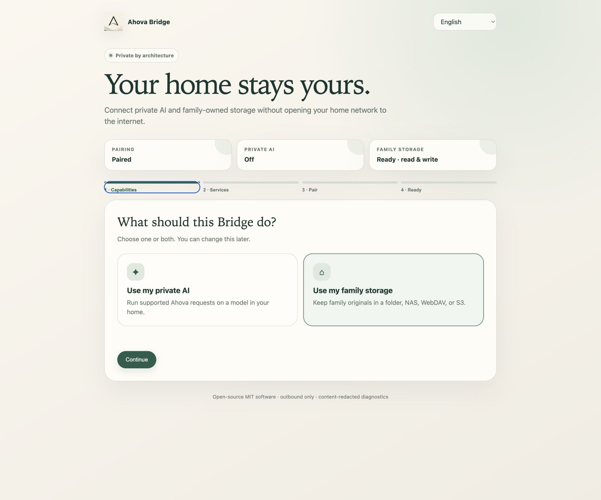

<p align="center">
  
</p>

<h1 align="center">Ahova Bridge</h1>

<p align="center">
  <strong>Your private AI and family-owned storage, connected to Ahova.</strong><br>
  Runs on your computer, home server, or NAS — without opening your home network to the internet.
</p>

<p align="center">
  <a href="https://github.com/IlyaBaikou/Ahova-Bridge/actions/workflows/ci.yml"></a>
  <a href="https://github.com/IlyaBaikou/Ahova-Bridge/releases/latest"></a>
  <a href="LICENSE"></a>
  
</p>

<p align="center">
  <a href="#start-in-five-minutes"><strong>Quick start</strong></a> ·
  <a href="https://github.com/IlyaBaikou/Ahova-Bridge/wiki"><strong>User guide</strong></a> ·
  <a href="docs/INSTALLATION.md">Installation</a> ·
  <a href="docs/AI_SETUP.md">Private AI</a> ·
  <a href="docs/STORAGE_SETUP.md">Family storage</a> ·
  <a href="docs/OPERATIONS.md">Operations</a> ·
  <a href="SECURITY.md">Security</a>
</p>



The local wizard keeps setup to four visible stages: choose capabilities, connect and test services,
pair with a one-time code, and confirm readiness. See the complete
[visual walkthrough](docs/INSTALLATION.md#visual-walkthrough).

## Your home stays yours

Ahova Bridge is a small open-source service that connects one Ahova Family Workspace to resources you
operate yourself. Ahova continues to handle family permissions, structured records, validation, and
synchronization; Bridge handles only the private capabilities you enable.

- **No inbound tunnel.** Bridge makes outbound HTTPS connections only.
- **No router changes.** The setup page stays on `127.0.0.1`.
- **No Smart Actions for private AI.** Ollama or LM Studio runs on your hardware.
- **No storage lock-in.** Keep originals in your folder, NAS, WebDAV service, or S3 bucket.
- **Revocable.** Disconnect the installation from Ahova or from the local wizard at any time.

## What can I connect?

| | Capability | Supported options |
| --- | --- | --- |
| ✦ | **Private AI** | Ollama, LM Studio, or another local OpenAI-compatible server |
| ◇ | **Folder or NAS** | Local folder, external disk, mounted SMB/NFS share |
| ◎ | **WebDAV** | Nextcloud, Synology WebDAV Server, or another compatible service |
| ◫ | **S3-compatible storage** | MinIO, Synology-compatible storage, AWS S3, or another SigV4 service |

Enable private AI, family storage, or both. Bridge storage holds file bytes; it is not a self-hosted copy
of the Ahova backend. Private model results remain proposals and pass the same authorization and
validation rules as managed processing.

## Start in five minutes

### 1. Install and start Docker

Use Docker Desktop 4.30+ on macOS/Windows or Docker Engine 26+ with Compose v2 on Linux.

### 2. Run one installer

**macOS or Linux**

```bash
curl -fsSL https://raw.githubusercontent.com/IlyaBaikou/Ahova-Bridge/main/scripts/install.sh | sh
```

**Windows PowerShell**

```powershell
irm https://raw.githubusercontent.com/IlyaBaikou/Ahova-Bridge/main/scripts/install.ps1 | iex
```

The installer finds the latest stable GitHub release, checks Docker, creates an `ahova-bridge` folder,
starts the container, and opens the local wizard at
[http://127.0.0.1:7433](http://127.0.0.1:7433). Set `AHOVA_BRIDGE_VERSION` only when you intentionally
want a specific release or preview branch.

> Prefer to inspect everything first? Clone the repository, copy `.env.example` to `.env`, then run
> `docker compose up -d`.

### 3. Complete four guided steps

1. Choose **private AI**, **family storage**, or both.
2. Let Bridge find Ollama or LM Studio and choose the discovered model. For storage, choose a folder,
   WebDAV, or S3. Technical addresses stay under **Advanced**.
3. Select **Save and test**. Bridge will show whether every enabled service is reachable before pairing.
4. In Ahova, open **More → Files & Smart Actions → Ahova Bridge**, create a one-time code, and paste it
   into the wizard.
5. Wait until the final page shows **Ready** for Ahova contact and every enabled capability.

The wizard follows the browser language and supports 14 languages, including Brazilian Portuguese,
Italian, Turkish, Polish, Ukrainian, Korean and Japanese. See [localization](localization/README.md).
The screenshots
in the installation guide show every stage and the exact healthy state to expect.

The pairing code expires after ten minutes and works once. A cancelled or failed pairing does not change
the family's active storage.

### 4. Check the result

From the installation folder:

```bash
./ahova-bridge doctor
```

On Windows, run `.\ahova-bridge.ps1 doctor`. A ready installation confirms Docker, the Bridge process,
pairing, recent Ahova contact, and all enabled capabilities.

## Pick your path

Prefer one guided place for setup and recovery? Open the
**[Ahova Bridge User Guide](https://github.com/IlyaBaikou/Ahova-Bridge/wiki)**.

| I want to… | Follow this guide |
| --- | --- |
| run supported requests through my own model | [Ollama and LM Studio](docs/AI_SETUP.md) |
| save new originals to a local folder or NAS | [Mounted folder / NAS](docs/STORAGE_SETUP.md#mounted-folder-or-nas) |
| connect Nextcloud or Synology WebDAV | [WebDAV](docs/STORAGE_SETUP.md#webdav--nextcloud-or-synology) |
| connect MinIO, Synology-compatible storage, or AWS S3 | [S3-compatible storage](docs/STORAGE_SETUP.md#s3-compatible-storage) |
| install Bridge on a remote Linux server | [Remote server](docs/INSTALLATION.md#remote-linux-server) |
| update, back up, restore, or remove Bridge | [Operations and recovery](docs/OPERATIONS.md) |

## After setup

Private AI becomes available without spending Smart Actions. If storage is enabled, select
**Personal storage** in **More → Files & Smart Actions** to use it for new originals. Existing files stay
where they are until an Owner explicitly starts and confirms a copy-and-verify migration.

The installed helper keeps routine operations simple:

| Command | What it does |
| --- | --- |
| `./ahova-bridge open` | Opens the local setup and status page |
| `./ahova-bridge doctor` | Checks Docker, pairing, Ahova contact, AI, and storage |
| `./ahova-bridge storage /path` | Selects a family folder and safely recreates Bridge |
| `./ahova-bridge update` | Pulls the configured image and recreates the container |
| `./ahova-bridge backup` | Creates a protected backup of Bridge state and credentials |
| `./ahova-bridge logs` | Shows recent content-redacted operational logs |
| `./ahova-bridge uninstall` | Removes the container while keeping state and family files |

Use `ahova-bridge.ps1` for the same commands on Windows.

## Requirements and preview limits

- current macOS or Windows with Docker Desktop, or 64-bit Linux `amd64`/`arm64`;
- about 100 MB for Bridge plus a small persistent state volume;
- outbound HTTPS to Ahova and GitHub Container Registry;
- optional Ollama/LM Studio and enough memory for your model;
- optional prepared folder/NAS, WebDAV account, or S3-compatible bucket;
- current preview relay limit: **5 MB per file**.

Bridge does not require a public IP, inbound firewall rule, Kubernetes, or separate database. The
one-line installer and `latest` container tag follow the newest stable release. Preview and
release-candidate builds never replace `latest`.

## Private by architecture

The worker, setup wizard, Docker image, adapters, protocol, tests, and threat model are inspectable under
the MIT License. Credentials stay in an owner-readable local state volume. Typed jobs use bounded leases,
replay protection, and crash-safe receipts.

Safe diagnostics contain no prompts, responses, model names, endpoints, paths, file names, credentials,
or tokens. The setup page must remain local; use an SSH tunnel for a remote server rather than publishing
port `7433`.

Read the [security policy](SECURITY.md) and [threat model](THREAT_MODEL.md) before deploying Bridge on a
new network. Support never needs remote shell access or access to family content. See the
[support boundary](SUPPORT.md) for safe troubleshooting.

---

<p align="center">
  Open source · outbound only · family controlled
</p>
